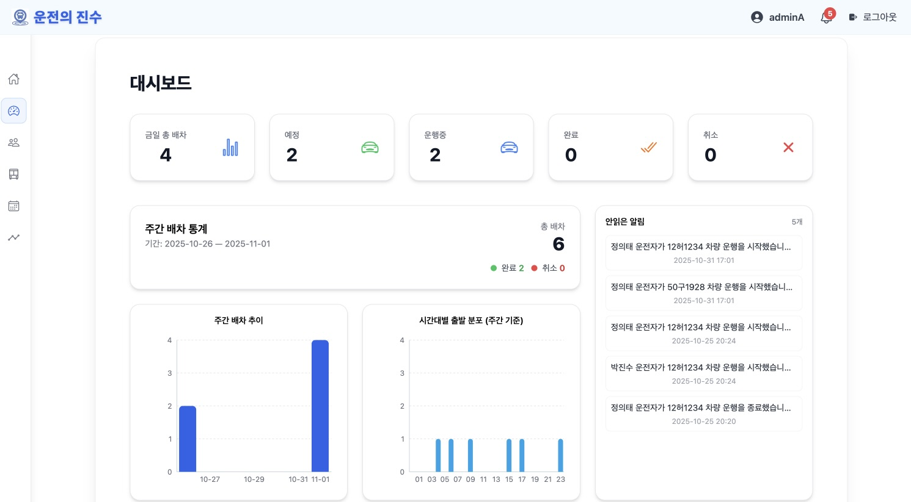

# 🚍 Corporate FMS Back-Office

> **운수 기업의 실시간 차량 운행 관제를 위한 FMS 백오피스 시스템**
> React & WebSocket을 기반으로 운전자 상태와 차량 위치를 실시간 시각화


---

## 🚧 Refactoring Journey (v1.0 → v2.0)

> **"기능 구현은 완료되었고, 현재는 구조 개선 중심으로 리팩토링을 진행 중입니다."**

이 프로젝트는 **v1.0에서 주요 기능 구현을 완료**했으나, 유지보수와 확장성 확보를 위해 **구조 및 책임 분리 중심의 v2.0 리팩토링**을 진행 중입니다.

- **v1.0 (Legacy):** 기능 구현 중심 (안정 버전) 👉 [Commit `e75d44334332ef5f0d5e22342e478179de605248`](https://github.com/ed-capstone-design/react-front/tree/e75d44334332ef5f0d5e22342e478179de605248)

- **v2.0 (Current / Refactoring in Progress):** 아키텍처 재설계 및 코어 모듈 구축 완료, 화면 기능 연결 중
  <details>
  <summary>2.0 진행상태</summary>
    아키텍처 재설계와 코어 모듈 구축 완료, 화면 단위 기능 연결 진행 중

  ✅ HTTP 로직 6계층 구조 적용  
   ✅ 도메인별 재사용 가능한 Custom Hooks(Auth, Map, Driver) 구축
  ✅ 토큰 관리 및 인증 상태 단일 레이어(SSOT) 확보  
   ✅ WebSocket 구조(Session / Client / Broker) 재설계  
   ✅ 라우팅 구조 리팩토링 및 Guard 컴포넌트 적용  
   ⚪ UI/페이지별 Page Hook 연결 진행 중  
   ⚪ 세부 기능 최적화 및 에러 처리 진행 중
  </details>

🔗 [📄 리팩토링 상세 보고서 (Velog)](https://velog.io/@yun0-0514/Engineering-%EC%8B%A4%EC%8B%9C%EA%B0%84-%EB%8D%B0%EC%9D%B4%ED%84%B0-%EA%B4%80%EC%A0%9C%EB%A5%BC-%EC%9C%84%ED%95%9C-FMS-%ED%81%B4%EB%9D%BC%EC%9D%B4%EC%96%B8%ED%8A%B8-%EC%95%84%ED%82%A4%ED%85%8D%EC%B2%98-%EC%9E%AC%EC%84%A4%EA%B3%84-%EB%A6%AC%ED%8F%AC%ED%8A%B8)

---

## 1. 프로젝트 개요 (Overview)

본 프로젝트는 운수 회사의 차량 운영 효율과 안전을 책임지는 **Corporate FMS(Fleet Management System) 백오피스**입니다.

현장의 모바일 앱(AI 영상 분석)과 OBD 장치(차량 제어 신호)에서 수집된 데이터를 **WebSocket**으로 수신하여, 관리자가 **실시간으로 차량 위치와 운전자의 위험 상태를 모니터링**하고 즉각 대응할 수 있는 시스템입니다.

### 핵심 기능 (Key Features)

- **🗺️ 실시간 위치 관제:** WebSocket 기반으로 차량의 현재 위치와 주행 상태를 지도 위에 지연 없이 시각화
- **🚨 AI 위험 알림:** 운전자의 **졸음·이상행동** 감지 시, 관리자에게 즉시 **Toast 알림**을 전송하여 골든타임 확보
- **👨🏻‍💻 주행 이력 분석:** 운행 종료 후 이동 경로(Route)를 지도에 재구성하고, **위험 이벤트 발생 지점을 아이콘**으로 시각화
- **🚍 통합 리소스 관리:** 복잡한 배차 일정, 기사 정보, 차량 관리를 위한 직관적인 **CRUD 시스템** 제공

---

## 2. Tech Stack

| 영역              | 기술 스택                                               |
| :---------------- | :------------------------------------------------------ |
| **Frontend**      | React `19.1`, React Router `7.6`                        |
| **Data / State**  | TanStack React Query `5.90`, Axios `1.13` (Interceptor) |
| **Real-time**     | WebSocket (SockJS `1.6`, STOMP `7.2`)                   |
| **Visualization** | Kakao Maps API, Recharts `3.2`, Tailwind CSS `3.4`      |
| **Utilities**     | dayjs (Timezone), jwt-decode (Auth)                     |

---

## 3. 주요 화면 (Screenshots)

### 3.1 대시보드 & 운전자 관리

|                           대시보드 (통계)                            |                                운전자 상세 조회                                |
| :------------------------------------------------------------------: | :----------------------------------------------------------------------------: |
|  |  |
|                   금일/금주 배차 통계 및 알림 현황                   |                      운전자별 배차 경고 및 상세 정보 관리                      |

### 3.2 실시간 관제 & 인사이트

|                             실시간 위치 관제                              |                              운행 상세 모니터링                               |
| :-----------------------------------------------------------------------: | :---------------------------------------------------------------------------: |
|  |  |
|                       전체 차량 위치 실시간 트래킹                        |                 **OBD 데이터** 및 **위험 이벤트** 초단위 관제                 |

---

## 🔥 Refactoring & Architecture

초기 프로젝트는 기능 구현은 완료되었지만, **유지보수와 확장성이 거의 없는 스파게티 상태**였습니다.
리팩토링의 핵심 목표는 **책임 중심 아키텍처 분리와 재사용성을 고려한 모듈화**였습니다.

### 📊 v1.0 vs v2.0 아키텍처 비교

| 구분           | Legacy (v1.0)                             | Refactoring (v2.0)                                                  | 개선 효과                                                   |
| :------------- | :---------------------------------------- | :------------------------------------------------------------------ | :---------------------------------------------------------- |
| **아키텍처**   | UI 파일 내 로직 혼재<br>(God Object 패턴) | **4-Layer Architecture**<br>(UI ↔ Hook ↔ Service ↔ API)             | 유지보수성 향상<br>테스트 용이성 확보                       |
| **상태관리**   | `useState`, `props drilling` 산재         | **Server State (React Query)**<br>+ **Client State (Context)** 분리 | **SSOT(Single Source of Truth)** 확보<br>데이터 불일치 해결 |
| **WebSocket**  | 단일 파일(551줄)이 모든 연결 처리         | **Session / Client / Broker** 분리                                  | 연결 안정성 강화<br>재구독 로직 간소화                      |
| **인증(Auth)** | 페이지별 토큰 처리 중복                   | **Centralized Auth Manager**<br>(Axios Interceptor 통합)            | 보안 로직 일원화<br>토큰 만료 자동 갱신                     |
| **코드 품질**  | 중복 코드 다수, 에러 처리 미흡            | **공통 에러 핸들링 & 훅 모듈화**                                    | 코드 라인 수(LOC) **35% 감소**                              |

### 🛠️ Key Refactoring Points (주요 개선 사항)

**1. 아키텍처 & 라우팅**

- 라우팅 중복 제거, `RoutesComponents` 컴포넌트로 접근 권한 중앙화
- 도메인별 Custom Hooks(Auth, Map, Driver)로 로직 분리 → 재사용성 ↑, 보일러플레이트 ↓

**2. 인증 & 네트워크**

- 토큰/인증 상태 단일 레이어(Context + Token Manager)로 통합 (SSOT)
- 6계층 REST API 구조 적용, 단일 책임 원칙(SRP) 기반 설계 → 디버깅·재사용 용이

**3. 실시간(WebSocket)**

- 중복 연결/구독 방지, 네트워크 에러 시 자동 복구
- Map/Set으로 구독 관리 → 이벤트 처리 속도 및 메모리 효율 개선

**4. 성능 & 상태 최적화**

- React Query로 서버 상태 캐싱, 불필요 호출 최소화
- 권한 문제 발생 시 즉시 로그아웃·세션 정리

🔗 [📄 리팩토링 상세 보고서 (Velog)](https://velog.io/@yun0-0514/Engineering-%EC%8B%A4%EC%8B%9C%EA%B0%84-%EB%8D%B0%EC%9D%B4%ED%84%B0-%EA%B4%80%EC%A0%9C%EB%A5%BC-%EC%9C%84%ED%95%9C-FMS-%ED%81%B4%EB%9D%BC%EC%9D%B4%EC%96%B8%ED%8A%B8-%EC%95%84%ED%82%A4%ED%85%8D%EC%B2%98-%EC%9E%AC%EC%84%A4%EA%B3%84-%EB%A6%AC%ED%8F%AC%ED%8A%B8)

---

## 🛠️ Trouble Shooting

### 1. 실시간 위치 동기화 및 렌더링 최적화

- **문제:** 여러 차량이 동시에 위치 데이터를 전송할 때, 지도 리렌더링 부하로 인한 '끊김 현상' 및 위치 점프(Jumping) 발생
- **해결:**
  - **Jitter Buffer:** 데이터를 즉시 렌더링하지 않고, 큐(Queue)에 담아 일정 주기로 보간(Interpolation)하여 부드럽게 이동 처리
  - **Throttle:** 렌더링 업데이트 주기를 제어하여 메인 스레드 부하 감소

### 2. 클라이언트-서버 시간 동기화 (Timezone)

- **문제:** 로컬 개발 환경과 AWS 배포 서버(UTC) 간의 시간 차이로 인해, 실시간 데이터의 타임스탬프가 어긋나는 현상
- **해결:** `dayjs` 플러그인을 활용하여 모든 시간을 클라이언트 브라우저의 Timezone 기준으로 변환하는 유틸리티 함수 `formatTime()` 표준화 적용

---

## 🏃 Getting Started

### 1. 레포지토리 클론

```bash
git clone https://github.com/ed-capstone-design/react-front.git
cd react-front

```

### 2. 특정 커밋 체크아웃 (안정화 버전)

> ⚠️ **현재 `main` 브랜치는 리팩토링 중입니다.** > 정상적으로 동작하는 v1.0(기능 구현 완료 커밋)를 확인하시려면 아래 커밋으로 이동해주세요.

```bash
git checkout e75d44334332ef5f0d5e22342e478179de605248

```

### 3. 패키지 설치 및 실행

```bash
npm install
npm start

```

- 브라우저 접속: `http://localhost:3000`
- Node.js 권장 버전: `v18+`

---

## 📬 Contact

- 📝 **Dev Log:** [https://velog.io/@yun0-0514](https://velog.io/@yun0-0514/series/%EC%BA%A1%EC%8A%A4%ED%86%A4%EB%94%94%EC%9E%90%EC%9D%B8-%EB%A6%AC%ED%8C%A9%ED%86%A0%EB%A7%81)
- 📧 **Email:** [ypy2141@naver.com](mailto:ypy2141@naver.com)
